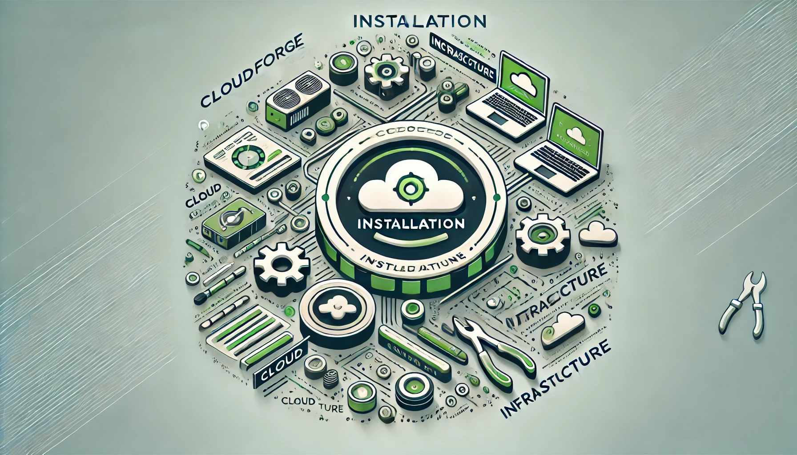

| **[README](README.md)** | **[CONTRIBUTORS](CONTRIBUTORS.md)** | **[MENU GUIDE](menu/MENU.md)** |


# CloudForge Installation Guide

This guide provides detailed instructions for installing and configuring the **CloudForge** project on your system.

## Prerequisites

The following tools are required to run **CloudForge**:

- **Bash** (Version 4.0+)
- **Terraform**
- **Ansible**
- **AWS CLI**
- **Python3**
- **jq**

### Platform-Specific Notes:
- **macOS**: Requires Homebrew for dependency installation.
- **Linux**: Requires `apt` or equivalent package manager.
- **Windows**: Requires Windows Subsystem for Linux (WSL) with Ubuntu.


## Installation Steps

### 1. Clone the Repository

Clone the **CloudForge** repository from GitHub:
```bash
git clone https://github.com/your-repo/cloudforge.git
cd cloudforge
```

### 2. Check and Install Dependencies

Run the dependency checker from the **menu** directory:
```bash
bash main_menu.sh
```

The script will:
- Detect missing dependencies.
- Provide options to install them based on your operating system.

### 3. OS-Specific Dependency Installation

#### **macOS**
Install dependencies using **Homebrew**:
```bash
brew install terraform ansible python3 jq
```

Install AWS CLI:
```bash
curl "https://awscli.amazonaws.com/AWSCLIV2.pkg" -o "AWSCLIV2.pkg"
sudo installer -pkg AWSCLIV2.pkg -target /
rm AWSCLIV2.pkg
```

#### **Linux (Debian/Ubuntu-based)**
Install dependencies using `apt`:
```bash
sudo apt update
sudo apt install -y terraform ansible python3 jq
```

Install AWS CLI:
```bash
curl "https://awscli.amazonaws.com/awscli-exe-linux-x86_64.zip" -o "awscliv2.zip"
unzip awscliv2.zip
sudo ./aws/install
rm -rf awscliv2.zip aws
```

#### **Windows (via WSL)**
Install WSL and set up Ubuntu:
1. Open PowerShell as Administrator and run:
   ```powershell
   wsl --install
   ```

2. After setting up WSL, follow the **Linux** instructions inside the WSL terminal.

### 4. Configure AWS CLI

Set up AWS credentials for Terraform and Ansible:
```bash
aws configure
```

Provide your:
- **Access Key ID**
- **Secret Access Key**
- **Default region** (e.g., `us-east-1`)

### 5. Run the Main Menu

Start the CloudForge project by running the main menu:
```bash
bash main_menu.sh
```

Follow the interactive prompts to provision infrastructure and configure services.

## Additional Notes

### Browser Configuration

The menu provides options to open URLs in your default browser. Ensure you have:
- **`xdg-open`** (Linux)
- **`open`** (macOS)
- **`wslview`** (Windows/WSL)

If these tools are missing, install them or manually open the provided URLs.

## Support

For any issues or questions, please open an issue on the **CloudForge** repository.