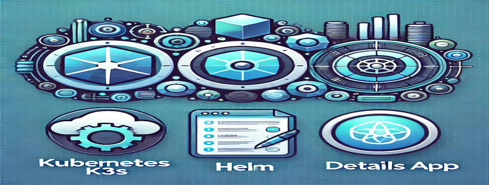

# K3S Details App

## Overview
The K3S Details App is a Kubernetes-based application designed to be deployed using Helm. It automates deployment with an accompanying script to ensure a smooth and repeatable setup. This repository provides a set of Kubernetes YAML files, Helm charts, and an automated setup script to make the deployment process easier.

## Features
- Helm-based Kubernetes deployment
- Secure handling of sensitive configurations using GPG and SOPS
- Automation with `setup.sh` script
- Configuration management using Kubernetes manifests

## Prerequisites
- Kubernetes cluster (local or cloud-based)
- Helm installed on your local system
- GPG for handling encrypted secrets
- `sops` installed for encryption management

## Usage
The `setup.sh` script will manage encryption and deployment. It performs the following:
1. Downloads and imports a private key for decryption.
2. Decrypts the `values_encrypted.yaml` file.
3. Deploys the Details App using Helm.

## Dependencies
To successfully run the **K3S Details Application**, the following dependencies are required:

**DetailsApp** (`details_app_old`) [GIT repository](https://github.com/lavishay-technion/details_app_old/tree/details_app_with_helm), [Docker Hub](https://hub.docker.com/layers/alayani/details_app/test/images/sha256-b023e92f9c9369a8f12c06d9acb1a6104ac000f82961fe8987f064c58567609e?context=repo).

### Required Tools

- **GPG** (`gpg`): Used for encryption to securely manage sensitive information.
- **SOPS** (`sops`): A tool to work with encrypted files, commonly used as a Helm secret plugin.
- **Helm** (`helm`): A package manager for Kubernetes that helps in deploying applications.
- **Kubernetes** (`k8s`) or **K3S** (`k3s`): Kubernetes or its lightweight version, K3S, to orchestrate containerized applications.


## Project Structure
- **[setup.sh](setup.sh)**: Script for deploying the K3S Details App, including encryption management.
- **[values_encrypted.yaml](values_encrypted.yaml)**: Contains encrypted configuration values used by Helm.
- **[deployment.yaml](details_app/templates/deployment.yaml), [service.yaml](details_app/templates/service.yaml), [ingress.yaml](details_app/templates/ingress.yaml), [pv.yaml](details_app/templates/pv.yaml), [pvc.yaml](details_app/templates/pvc.yaml)**: Kubernetes manifests for deploying resources.
- **[Chart.yaml](details_app/Chart.yaml)**: Helm chart configuration file.
- **[TASK.md](TASK.md)**: Project-related tasks and requirements.

```bash
📁 K3S_DETAILS_APP
├──📁 assets
|   ├──🏞️ contribute.png
|   ├──🏞️ installation.png
|   └──🏞️ k3s_detaild_app.png
├──📁 details_app
│   └──📁 templates
│   |    ├──🧾 deployment.yaml
│   |    ├──🧾 ingress.yaml
│   |    ├──🧾 pv.yaml
│   |    ├──🧾 pvc.yaml
│   |    ├──🔐 secrets.yaml
│   |    └──🧾 service.yaml
|   ├──❌ .helmignore
│   └──📊 Chart.yaml
├──❌ .gitignore
├──👥 CONTRIBUTERS.md
├──🛠️ INSTALLATION.md
├──📖 README.md
├──💾 setup.sh
├──📋 TASK.md
└──🈵 values_encrypted.yaml
```