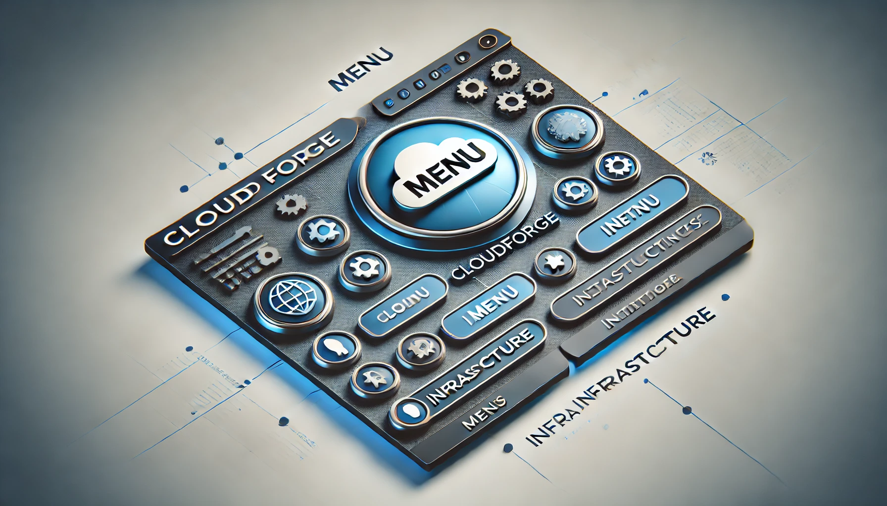

| **[README](../README.md)** | **[INSTALATION](../INSTALATION.md)** | **[CONTRIBUTORS](../CONTRIBUTORS.md)** |

## Main Menu

The main menu (`menu.sh`) offers the following options:

1. **Check and Install Dependencies**  
   - Checks for required tools like Terraform, Ansible, and AWS CLI.
   - Provides options to install missing dependencies.
   
2. **Install and Run All Project**  
   - Initializes Terraform to provision infrastructure.
   - Runs Ansible playbooks to configure K3S.

3. **Rollout & Rollback**  
   - Manage Kubernetes deployments with the following sub-options:
     - Rollout K3S changes.
     - Rollback previous deployments.
     - View `kubectl` output for deployments, pods, nodes, and services.

4. **Run Step-by-Step**  
   - Allows guided execution of individual components:
     - Terraform setup and deployment.
     - Ansible configuration.

5. **Open Prod Env URL**  
   - Opens the production environment in the default browser.

6. **Open Dev Env URL**  
   - Opens the development environment in the default browser.

7. **Terraform Destroy**  
   - Cleans up resources by destroying infrastructure provisioned by Terraform.

---

## Submenus in `menu/`

### `dependencies.sh`
Checks and installs project dependencies:
- **Sub-options**:
  - Install tools like Ansible, AWS CLI, Terraform, and Python3 individually.

### `terraform.sh`
Handles Terraform operations:
- Initializes the backend.
- Applies Terraform configurations.
- Destroys infrastructure.

### `ansible.sh`
Runs Ansible playbooks:
- Configures K3S on the provisioned AWS infrastructure.

### `k3s.sh`
Manages Kubernetes operations:
- **Sub-options**:
  - Rollout or rollback K3S changes.
  - View `kubectl` output (deployments, pods, nodes, and services).

### `step_by_step.sh`
Guides users through:
- Running Terraform commands.
- Configuring Ansible.
- Reviewing the setup step-by-step.

---

## Example Navigation

1. Select **1. Check and Install Dependencies**.
2. Follow the prompts to install missing tools.
3. Return to the main menu and choose **2. Install and Run All Project**.
4. Use **3. Rollout & Rollback** for Kubernetes management.

## Menu Structure
```plantext
CloudForge/
├── menu/                 # Modular shell scripts for different operations
│   ├── banner.sh         # Displays project banner
│   ├── colorize.sh       # Adds color-coded text functionality
│   ├── dependencies.sh   # Checks and installs project dependencies
│   ├── terraform.sh      # Terraform-related operations
│   ├── ansible.sh        # Ansible configuration management
│   ├── k3s.sh            # Kubernetes management (rollout/rollback)
│   ├── MENU.md           # Detailed guide for navigating the menus
│   └── step_by_step.sh   # Guided step-by-step operations
└── menu.sh               # Main entry point for the interactive menu        
```